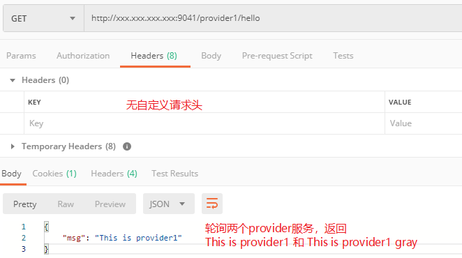
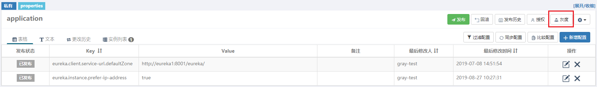
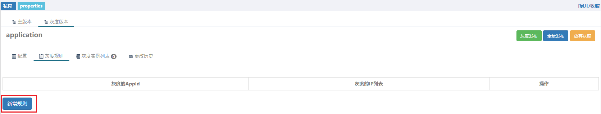
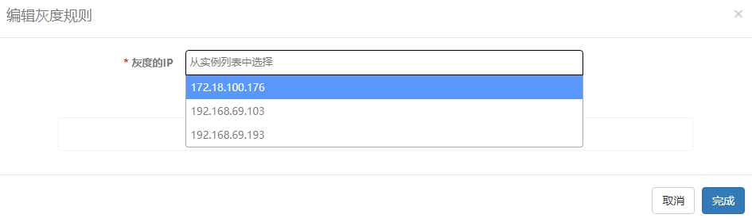
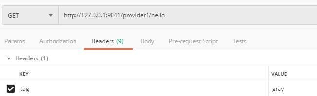
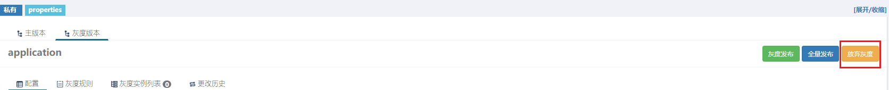
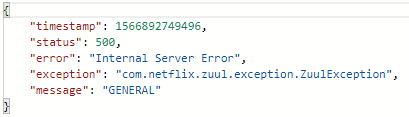

# springcloud-gray-example
Zuul网关上基于Ribbon和Eureka元数据的灰度路由实现（需使用Apollo达到配置灰度元数据）

 

## 服务简介

- **springcloud-gray-eureka**：普通的eureka注册中心
- **springcloud-gray-provider1**： 只有/hello端点，返回 {"msg": "This is provider1"}，使用`EurekaMetadataRefresher`监听Apollo推送的关于`eureka.instance.metadata-map.`元数据的配置变更，并将元数据配置变更发送到Eureka Server
- **springcloud-gray-provider1-gray**：与springcloud-gray-provider1不同点就是/hello端点返回的是 {"msg": "This is provider1 gray"}
- **springcloud-gray-zuul**：集成灰度路由规则的网关

 

## 如何测试

### 1、环境准备

准备2台服务器，并分别在其hosts里配置

> 服务器1IP       eureka1

在 **服务器1** 启动

- springcloud-gray-eureka
- springcloud-gray-provider1
- springcloud-gray-zuul

在 **服务器2** 启动

- springcloud-gray-provider1-gray

> 注意：之所以需要在2台服务器分别启动 springcloud-gray-provider1、springcloud-gray-provider1-gray，是因为Apollo配置中心在配置灰度规则时，只能根据IP来区分将灰度配置发布给谁，所以如果两个provider都部署在一台服务器或本机，发布灰度配置时就区分不出来了

环境准备完成后，在 eureka server页面上可以看到两个provider

### 2、普通测试

使用Postman通过zuul网关调用后端的provider 和 provider-gray

端点：GET  http://xxx.xxx.xxx.xxx:9041/provider1/hello

### 3、发布灰度配置

进入Apollo项目，点击“灰度”

 

新增灰度配置

 

新增灰度规则（即哪台服务器使用灰度配置，选择部署了provider-gray服务的那台服务器）

选择发布灰度配置的服务器IP后，点击灰度发布即可

 

### 4、灰度路由测试

等待接收到配置变更的provider-gray服务向Eureka Server发送元数据变更请求，Eureka Server刷新其只读缓存，Zuul作为Eureka Client读取到最新配置并刷新Ribbon缓存后，灰度配置的元数据才真正生效，默认需要等待1-2分钟，如果嫌时间太长，可以调短各缓存刷新时间

再次使用Postman测试端点：GET  http://xxx.xxx.xxx.xxx:9041/provider1/hello

此时只会返回

因为，设置的灰度规则为：凡是不带有灰度标签tag:gray的请求，只能轮询的路由到服务的元数据中tag为空的，说明此时provider-gray已经被设置metadata元数据

 

使用Postman在请求头携带 tag:gray测试

此时只能返回  {"msg": "This is provider1 gray"}

说明请求头带灰度标签的请求被路由到了灰度节点

 

### 5、撤销灰度

在Apollo配置中心，选择“放弃灰度”

再等待缓存刷新完成后，仍然使用带有tag:gray的请求，此时返回

由于已经没有灰度服务实例，但仍要路由到元数据带tag:gray的服务，由于找不到而报错

去掉Postman的tag请求头，即可轮询访问 provider 和 provider-gray

